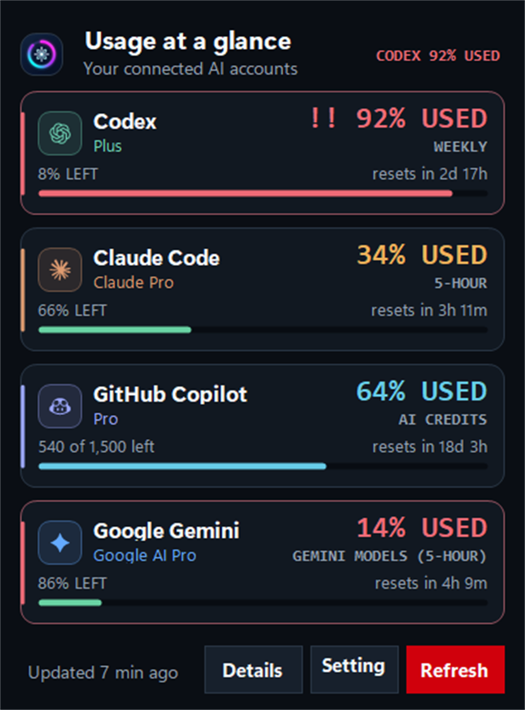

# UsageAI

A small, personal Windows tray meter for Codex, Claude Code, and GitHub Copilot usage limits.

UsageAI reuses your existing local provider login. Codex data comes from the Codex CLI app-server; Claude Code data comes from Anthropic using an explicitly supplied Claude web session or Claude Code's saved OAuth login; Copilot data comes from GitHub using a token already saved by a Copilot IDE extension or Copilot CLI's secure Windows credential. UsageAI never prints those credentials and never scans browser storage.



## Install

Download the latest release from the [Releases page](https://github.com/VladiKogan/UsageAI/releases):

- **`UsageAI-<version>-Setup.exe`** — installer with a Start Menu shortcut and uninstaller. Installs the .NET 10 Desktop Runtime automatically if it isn't already on your machine.
- **`UsageAI-<version>-portable.exe`** — a single file, no installation. Just run it.

Both need Windows 10 or 11 (x64) and at least one signed-in provider (see [Requirements](#requirements) below). Each download has a matching `.sha256` file; see [Build and test](#build-and-test) for how to verify it.

## What it shows

- Every usage window each provider reports, rather than a fixed pair: Codex five-hour, weekly, credits, and reset credits; Claude five-hour, weekly, weekly Opus, and extra usage; Copilot AI credits or premium requests, chat, and completions
- A consumption meter whose fill and headline both show what is **used**, with capacity left shown as the secondary value
- Reset countdowns, plan, and account for each provider
- A trend sparkline and a burn-rate forecast: "At this pace, empty by 15:20"
- Tray notifications when a window crosses your alert thresholds, and when it resets
- Colour that escalates with consumption across the value, the meter, the card rail, and the tray icon
- A selectable tray-icon provider, with an automatic mode that follows the connected provider with the highest usage
- The last good reading kept and labelled **stale** when a refresh fails, instead of an emptied dashboard
- A compact all-provider view and a full dashboard with every metric and connection status
- Light, dark, or follow-Windows themes, using your Windows accent colour

## Requirements

- Windows 10 or 11
- [.NET 10 SDK](https://dotnet.microsoft.com/download/dotnet/10.0)
- At least one supported provider login:
  - Codex CLI installed and signed in (`codex login`)
  - Claude Code installed and signed in (`claude`), or an explicitly supplied Claude web session key
  - GitHub Copilot signed in through an IDE extension or Copilot CLI

PowerShell can block the `codex.ps1` launcher; UsageAI intentionally uses `codex.cmd`, so it works with the default Windows execution policy.

## Run it

```powershell
dotnet run --project .\UsageAI.csproj
```

The app lives in the system tray.

| Action | Result |
| --- | --- |
| Left-click the tray icon | Compact view of every connected provider |
| **Win+Alt+U** | Same as left-click, from anywhere |
| Right-click ▸ **Open** | Full dashboard with all providers and metrics |
| Right-click ▸ **Settings...** | Preferences (see below) |
| Launching UsageAI again | Brings the running instance forward |
| `Esc` | Hides the window |
| `Tab` / `Enter` on a dashboard card | Opens the provider's usage page, or copies its sign-in command when disconnected |

The dashboard behaves like a regular Windows window: move it, resize it, minimize or maximize it, and close it back to the tray. Its position and size are remembered between runs.

## Settings

**Settings...** in the tray menu covers:

- Refresh interval, and whether to slow down while no window is open
- Alert thresholds, and whether resets are announced
- Theme, and the percentages at which the warning and critical colours start
- Whether usage history is recorded, and whether the trend and forecast are shown
- Which provider drives the tray icon, which providers appear, and in what order
- The global hotkey
- An opt-in check for newer releases on GitHub

Preferences, recorded history, and the cached last reading live in `%LOCALAPPDATA%\UsageAI`. Set `USAGEAI_DATA_DIR` to an absolute path to move them, for a portable install. History holds timestamps, provider ids, metric names, and percentages; it never leaves the machine and can be deleted from the settings window.

## Diagnostics

To validate one provider without opening the tray UI:

```powershell
dotnet run --project .\UsageAI.csproj -- --diagnose codex
dotnet run --project .\UsageAI.csproj -- --diagnose claude
dotnet run --project .\UsageAI.csproj -- --diagnose copilot
```

`--help` lists every switch and `--version` prints the build version. Diagnostic output contains account identity and usage metadata. It never contains provider tokens, but review it before sharing it publicly.

## Claude authentication

UsageAI tries Claude authentication in this order:

1. An explicitly supplied Claude web session key from `USAGEAI_CLAUDE_SESSION_KEY`. The compatible `CLAUDE_AI_SESSION_KEY` and `CLAUDE_WEB_SESSION_KEY` names are also accepted.
2. Claude Code's saved OAuth login from its normal credential store.

The first option follows Win-CodexBar's web-usage approach, but UsageAI deliberately does not extract cookies from browsers. A Claude session cookie is more privileged than a usage-only token: supply it only to the UsageAI process, do not place it in source control or scripts, and rotate it immediately if it is exposed.

For a process-scoped PowerShell session:

```powershell
$env:USAGEAI_CLAUDE_SESSION_KEY = '<your sessionKey value>'
dotnet run --project .\UsageAI.csproj
Remove-Item Env:USAGEAI_CLAUDE_SESSION_KEY
```

The session key is kept in memory, is not forwarded to provider CLI child processes, and is never written by UsageAI. If it is missing, invalid, or no longer accepted, UsageAI safely falls back to Claude Code OAuth.

## Build and test

```powershell
dotnet build .\UsageAI.sln -c Release
dotnet run --project .\UsageAI.Tests\UsageAI.Tests.csproj
```

The test project is a dependency-free console harness covering credential handling, bounded I/O, provider response parsing, settings validation, history, forecasting, and alert behaviour. It runs with `dotnet run`, not `dotnet test`.

To regenerate the screenshot:

```powershell
dotnet run --project .\UsageAI.csproj -- --render-preview .\usageai-preview.png
```

## Build a personal executable

```powershell
dotnet publish .\UsageAI.csproj -c Release -r win-x64 --self-contained false -p:PublishSingleFile=true -o .\publish
```

Run `publish\UsageAI.exe`. The single-file, framework-dependent build is deliberately small and uses the installed .NET 10 desktop runtime. This is the portable build; rename it to `UsageAI-<version>-portable.exe` before publishing it as a release asset.

## Build the installer

Install [Inno Setup](https://jrsoftware.org/isinfo.php) 6.3 or newer, publish the portable build above, then:

```powershell
& "$env:LOCALAPPDATA\Programs\Inno Setup 6\ISCC.exe" .\installer\UsageAI.iss /DMyAppVersion=<version>
```

This produces `installer\Output\UsageAI-<version>-Setup.exe`. It installs to Program Files, adds a Start Menu shortcut and uninstaller, and checks for the .NET 10 Desktop Runtime at install time, silently installing it first if it's missing (see `installer\UsageAI.iss` for the check).

Before uploading either asset to a release, generate its checksum:

```powershell
foreach ($file in 'publish\UsageAI.exe', 'installer\Output\UsageAI-<version>-Setup.exe') {
    $hash = (Get-FileHash -Path $file -Algorithm SHA256).Hash.ToLower()
    "$hash  $(Split-Path $file -Leaf)" | Set-Content -NoNewline "$(Split-Path $file -Leaf).sha256"
}
```

UsageAI releases are built and checked locally, then uploaded manually to GitHub Releases as `UsageAI-<version>-Setup.exe`, `UsageAI-<version>-portable.exe`, and their `.sha256` files. The GitHub `Build` workflow only restores, builds, and tests; it never publishes.

## Troubleshooting

- **Codex CLI was not found:** ensure `codex.cmd` is on `PATH`, or set `CODEX_PATH` to its full path.
- **Codex is not signed in:** run `codex login` in a terminal, then choose **Refresh**.
- **Claude Code is not signed in:** run `claude` and complete sign-in, or use the opt-in Claude session-key method above, then choose **Refresh**.
- **A custom Claude OAuth token is needed:** set `USAGEAI_CLAUDE_OAUTH_TOKEN` for the UsageAI process. The token must have the `user:profile` scope and is never persisted by UsageAI.
- **Copilot is not signed in:** sign in through a GitHub Copilot IDE extension or Copilot CLI, then choose **Refresh**.
- **A custom Copilot token is needed:** set `COPILOT_GITHUB_TOKEN` for the UsageAI process. The token is used in memory and is not persisted.
- **GitHub CLI fallback is needed:** set `USAGEAI_ENABLE_GH_TOKEN_FALLBACK=1` for the UsageAI process. This is disabled by default because `gh auth token` can expose a broader GitHub token than Copilot usage requires.
- **A card says "stale":** the last refresh failed, so the values shown are the previous good reading. The card carries the provider's own error message, and UsageAI backs off before retrying instead of polling a failing or rate-limited provider on a fixed cadence.
- **The hotkey does nothing:** another application already owns Win+Alt+U. Turn it off in **Settings...** to stop UsageAI from claiming it.
- **No tray icon:** open the Windows tray overflow menu and pin UsageAI.

The provider protocols and usage endpoints can change. UsageAI keeps each integration isolated in its own usage client so future changes stay easy to update, and each client's response parsing is covered by fixture tests.
