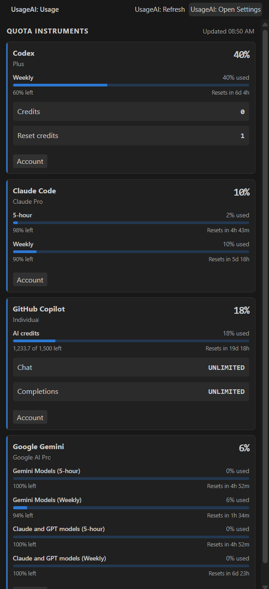
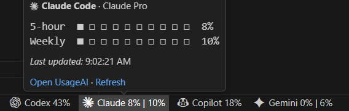

# UsageAI for VS Code and Antigravity

See how much of your Codex, Claude Code, GitHub Copilot, and Google Gemini allowance you have used—without leaving your editor.

UsageAI gives you a clear dashboard in the Activity Bar and optional Status Bar readings for the providers you care about. It uses the provider sign-ins already available on your computer, so there is no separate UsageAI account to create.

## Preview

<p align="center">
  
</p>

Open UsageAI from the Activity Bar to see each provider's usage, remaining allowance, and reset time in one place. You can also move the view to the Secondary Sidebar or Panel to match your editor layout.

<p align="center">
  
</p>

Choose one or more providers for compact Status Bar readings. Hover over a reading to see its usage windows, segmented meters, last update time, and quick links to open or refresh UsageAI.

## Install

The current extension release is **0.1.13**. Install it from the [Visual Studio Marketplace](https://marketplace.visualstudio.com/items?itemName=vladikogan.usageai) or [Open VSX](https://open-vsx.org/extension/vladikogan/usageai).

For a manual installation, download [`usageai-0.1.13.vsix`](https://open-vsx.org/api/vladikogan/usageai/0.1.13/file/vladikogan.usageai-0.1.13.vsix), then run **Extensions: Install from VSIX...** in VS Code or Antigravity.

## Get started

1. Make sure you are signed in to at least one supported AI provider.
2. Select the UsageAI icon in the Activity Bar.
3. Give the first refresh a moment to find your local provider sign-ins and load their usage.
4. Select any UsageAI Status Bar reading to reopen the dashboard.

You can also run **UsageAI: Show Usage**, **UsageAI: Refresh**, or **UsageAI: Open Settings** from the Command Palette.

## Supported providers

You only need one of these sign-in methods:

| Provider | What UsageAI looks for |
| --- | --- |
| Codex | A Codex CLI sign-in created by `codex login` |
| Claude Code | A Claude Code sign-in created by running `claude`, or the optional `USAGEAI_CLAUDE_SESSION_KEY` environment variable |
| GitHub Copilot | A supported local Copilot credential, `COPILOT_GITHUB_TOKEN`, or the optional GitHub CLI fallback |
| Google Gemini | A sign-in through Google's Antigravity VS Code extension or `agy` (recommended), a Gemini CLI sign-in, or a running Antigravity language server |

UsageAI requires VS Code 1.90 or newer, or a compatible Antigravity IDE build. It is a desktop extension because it needs access to local provider files and commands; it does not run in vscode.dev or github.dev.

## Choose what appears

Open **UsageAI: Open Settings** to personalize the extension:

- **UsageAI: Providers** enables providers and sets their order in both the dashboard and Status Bar.
- The **UsageAI: Status Bar** checkboxes give each selected provider its own compact reading.
- If no provider checkbox is selected, **Hottest When None Selected** shows the connected provider with the highest current usage. Turn it off to hide UsageAI from the Status Bar.
- **Warning Percent** and **Critical Percent** control when usage meters change color.
- The foreground and background refresh intervals control how often readings update while the dashboard is open or hidden.

For GitHub Copilot, **Enable GitHub CLI Fallback** lets UsageAI run `gh auth token` only when it cannot use a supported local credential file. This option is off by default.

## Reading the dashboard

- Percentages and meter fill show how much quota has been **used**.
- The text under each meter shows what remains and when that limit resets.
- Providers can report more than one limit, such as a session window and a weekly window; UsageAI shows each one separately.
- If a refresh fails, the last successful reading stays visible and is marked as stale instead of disappearing. The dashboard and Status Bar distinguish that last good reading from the failed check and show the next automatic retry; retry-only checks do not disturb healthy providers or regular polling.

If a provider says it is not connected, sign in with that provider's CLI or IDE integration and run **UsageAI: Refresh**. You can use the provider card's sign-in action when one is available.

## Privacy and security

Your provider credentials stay in the extension host. UsageAI does not scan browser storage, send credentials to the dashboard webview, or include credentials in its cached usage snapshots.

Additional protections include allowlisted provider endpoints, blocked redirects, size-limited responses, read-only Claude OAuth credentials, in-memory-only refresh caching for other providers, and a local Antigravity connection reachable only over loopback. When Claude's short-lived access token expires, the extension briefly invokes the official `claude auth status --json` command with bounded runtime and output, then rereads the credentials. Claude Code remains the only process that can exchange the shared refresh token or update its credential store. The optional Claude web session key remains an environment variable and is never saved by UsageAI.

When no Antigravity language server is already available, the extension starts one long-lived
`agy --hub` server on a loopback port and reads quota from it for the rest of the session, so
refreshes launch no child process of their own. This includes the backend installed by Google's
official VS Code extension. The hub is reachable only from this machine, is gated by a token the
extension mints into the CLI's environment, and is stopped when the extension deactivates. Should the
installed CLI predate `--hub`, the extension falls back to a short read-only `agy -p /usage` run with
stdin closed and bounded output and runtime. A failed cold start is skipped while a healthy Gemini CLI
fallback remains available; if both paths are stale, the next refresh retries `agy` immediately. Only
the process tree started by UsageAI is cleaned up. VS Code does not need to remain open after sign-in,
and UsageAI never reads or modifies Antigravity credentials.

Cached snapshots may contain usage information, reset times, plan names, and account labels so the extension can keep the last successful reading available.

## Development

```powershell
cd extension
npm.cmd install
npm.cmd test
npm.cmd run test:coverage
```

Open the `extension` folder in VS Code and press `F5` to launch an Extension Development Host.

Package an installable artifact:

```powershell
npm.cmd run package:vsix
```

The resulting VSIX can be installed manually in both VS Code and Antigravity. Marketplace publication uses the same artifact:

```powershell
npm.cmd run publish:vscode -- --packagePath usageai-0.1.13.vsix
npm.cmd run publish:openvsx -- usageai-0.1.13.vsix
```

Publishing requires separate publisher identities and credentials for Visual Studio Marketplace and Open VSX.
